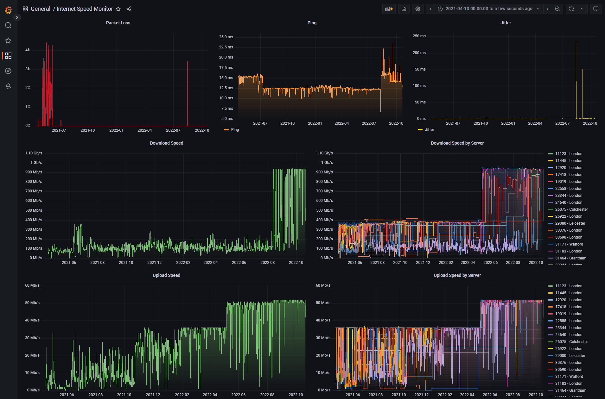
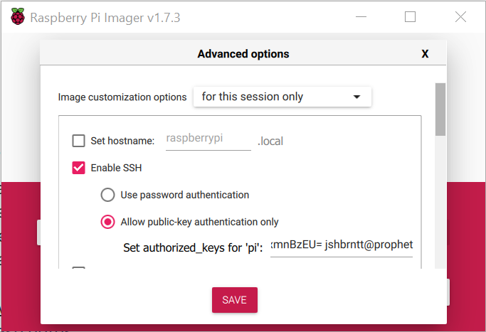
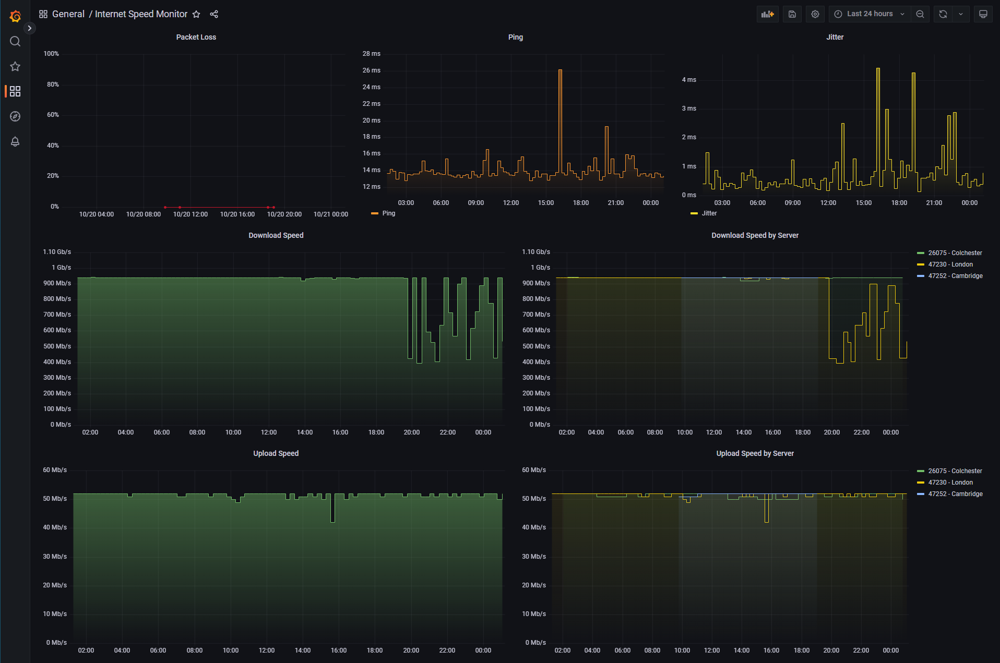

# Speed Monitor Pi

I built this tool for a blog post I wrote about my internet speed during the pandemic, which can be found here.

- [How COVID-19 affected my internet connection](https://jshbrntt.dev/posts/how-covid-19-affected-my-internet-connection/)

This tool runs an [Ansible][ansible] playbook in a [Docker][docker] container to provision a Raspberry Pi for the purpose of monitoring internet speed.

- Tested on Raspberry Pi OS Lite (64-bit) with a Raspberry Pi 4 Model B.
- Using OS version: `2022-09-22-raspios-bullseye-arm64-lite.img.xz` (but later versions should also work!).



### Requirements
- [Raspberry Pi](https://www.raspberrypi.org/) 3 Model B+ or 4 Model B (**Gigabit capable**)
- [Docker][docker] >= v20.10.17
- [GNU Make][make] >= 4.3

### Services Installed
- [InfluxDB](https://portal.influxdata.com/downloads/) v2.4.0
- [Grafana](https://grafana.com/docs/grafana/latest/setup-grafana/installation/) v9.2.0
- Cron job for running `speedtest.py` script
    - [Speedtest CLI](https://www.speedtest.net/apps/cli) v1.2.0
    - [influxdb-client-python](https://github.com/influxdata/influxdb-client-python) v1.33.0

### Setup

1.  Install [Docker](https://docs.docker.com/get-docker/).

2.  Install GNU Make (*if your OS doesn't provide it by default*).

3.  Generate an SSH key to access the Raspberry Pi with.

    ```shell
    $ ssh-keygen
    ```

4.  Use the [Raspberry Pi Imager](https://www.raspberrypi.com/software/) to install Raspberry Pi OS Lite (64-bit) to your SD card.

    

5.  Ensure you have `Enable SSH` and `Allow public-key authentication only` options set with your SSH key's public key.

    

6.  Insert the SD card into your Pi.

7.  Connect your Pi to the same LAN as your PC and power it on.

8.  Run the following command to provision your Pi.

    You can specify any of the following parameters to customize the installation.

    ```shell
    # You can specify any of the following parameters to customize the installation.

    # Defaults:

    # HOST=raspberrypi.local  [Address of the Raspberry Pi]
    # SSH_USER=pi             [SSH user]
    # SSH_KEY=~/.ssh/id_rsa   [Location of the SSH private key]
    # CRON='*/30 * * * *'     [Speedtest interval (Every 30 minutes)]

    $ make HOST='...' SSH_USER='...' SSH_KEY='...' CRON='...'
    ```

    ## Preview

    [](https://asciinema.org/a/t1KNY1QrKAJWiu2aPVcjUmx2f)

9.  Access your **Internet Speed Monitor** Grafana dashboard here, with `admin:admin`.

    - http://raspberrypi.local:3000/d/internet-speed-monitor/internet-speed-monitor?orgId=1

10. You should see new data points every 30 minutes (by default).

    

[rpi]: https://www.raspberrypi.org/
[docker]: https://docs.docker.com/get-docker/
[make]: https://www.gnu.org/software/make/
[ansible]: https://www.ansible.com/
